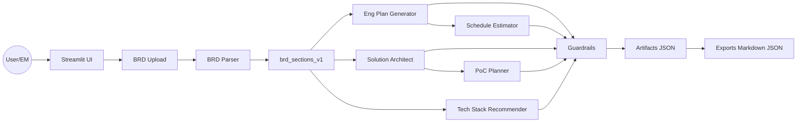

# Architecture Diagram (Mermaid)

```mermaid
flowchart LR
  user((User/EM)) --> ui[Streamlit UI]
  ui --> brd[BRD Upload]
  brd --> parser[BRD Parser]
  parser --> sections[brd_sections_v1]

  sections --> plan[Eng Plan Generator]
  plan --> schedule[Schedule Estimator]

  sections --> architect[Solution Architect]
  architect --> poc[PoC Planner]
  sections --> stack[Tech Stack Recommender]

  plan --> guardrails[Guardrails]
  schedule --> guardrails
  architect --> guardrails
  poc --> guardrails
  stack --> guardrails

  guardrails --> artifacts[Artifacts JSON]
  artifacts --> export[Exports Markdown JSON]
```
