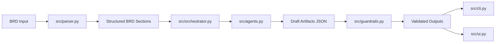
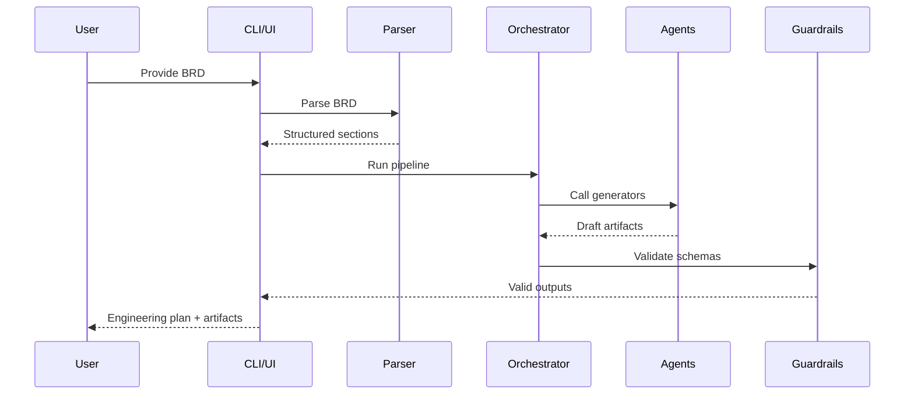

# BRD-to-Engineering System Generator (Python)

Pure Python implementation of the BRD-to-Engineering system generator without
n8n. It parses BRDs, calls LLM agents, applies guardrails, and outputs artifacts.

## Structure
```
BRD-2-SystemGenerator-python/
├── src/
│   ├── config.py
│   ├── parser.py
│   ├── agents.py
│   ├── guardrails.py
│   ├── orchestrator.py
│   └── cli.py
├── tests/
│   └── test_pipeline.py
└── requirements.txt
```

## Architecture


## Workflow


## Run
```
python -m venv .venv
source .venv/bin/activate
pip install -r requirements.txt
cp .env.example .env
# edit .env with your OpenAI key
python src/cli.py --input ../BRD-2-SystemGenerator/brd_agent_em/sample_inputs/sample_brd.md
```

## System Prompt
Set `SYSTEM_PROMPT` in `.env` to control the model's system instruction.

## Engineering Plan Schema
Each phase in `engineering_plan.schema.json` includes:
- `name`, `objectives`, `key_deliverables`, `dependencies`, `acceptance_criteria`

## Fallbacks
If a model call fails, the pipeline returns minimal fallback JSON defined in
`src/fallback.py` to keep outputs schema-safe.

## ROI Model (Transparent)
Use this to estimate time and cost savings for your org.

**Inputs**
- BRD length (pages)
- Complexity (low/medium/high)
- Review cycles (count)
- Hourly cost of EM/Architect

**Assumptions**
- Manual drafting time (per BRD): 6–12 hours
- AI draft time + review: 1–3 hours

**Outputs**
- Hours saved per BRD
- % time reduction
- Cost savings per BRD/quarter

## Streamlit UI
```
streamlit run src/ui.py
```

## Environment
- `OPENAI_API_KEY` for live LLM calls.
